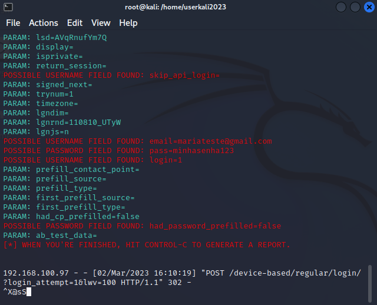

# -cibersecurity-desafio-phishing

# Phishing para captura de senhas do Facebook

### Ferramentas

- [X] Kali Linux
- [X] setoolkit

##  Configurando o Phishing no Kali Linux

- [X] Acesso root: ``` sudo su ```
- [X] Iniciando o setoolkit: ``` setoolkit ```
- [X] Tipo de ataque: ``` Social-Engineering Attacks ```
- [X] Vetor de ataque: ``` Web Site Attack Vectors ```
- [X] Método de ataque: ```Credential Harvester Attack Method ```
- [X] Método de ataque: ``` Site Cloner ```
- [X] Obtendo o endereço da máquina: ``` ifconfig ```
- [X] URL para clone: http://www.facebook.com


### Resutados


